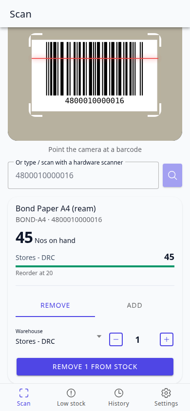
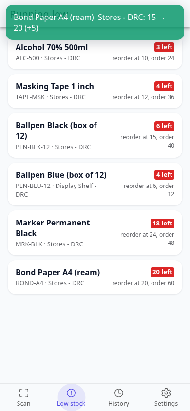
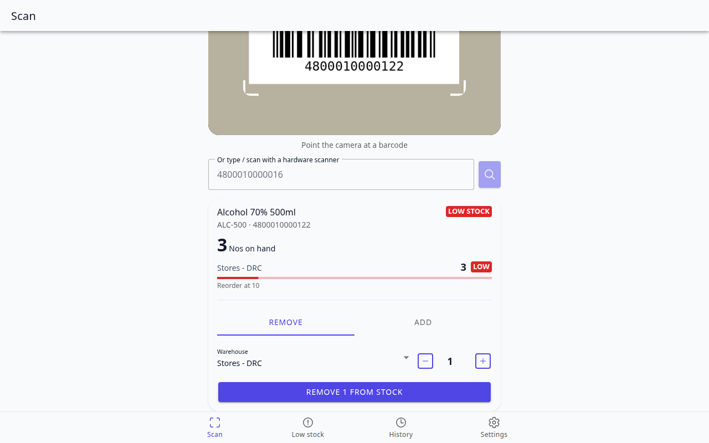

# Stock Scanner

An installable **Ionic + React** app (a PWA) for the stockroom: point the phone camera at a barcode, see how much is on hand in each warehouse, and add or remove units. It also lists what's running low.

It works with three interchangeable backends, so the same app can run as an online demo or against a real ERP:

| Backend | What it is | When to use it |
| --- | --- | --- |
| **Demo** | Sample items kept in the browser (localStorage) | Works with no setup at all |
| **Supabase** | A shared PostgreSQL demo database | The public online demo |
| **ERPNext** | Your server running the [Inventory Hub](https://github.com/Klineyyy/inventory-hub) app | The real thing: every change becomes a proper Stock Entry |

The demo catalogue is the same 12 items, barcodes and quantities in all three, so a barcode gives the same answer everywhere.

| Scan | Low stock | Desktop |
| --- | --- | --- |
|  |  |  |

## Features

- **Camera scanning** with [ZXing](https://github.com/zxing-js/library), so it works in any browser (it doesn't depend on the `BarcodeDetector` API, which iPhone Safari lacks). Reads EAN-13, EAN-8, UPC-A, UPC-E, Code 128 and Code 39. Beeps and buzzes on a read.
- **Hardware scanners work too.** A USB or Bluetooth scanner types digits and presses Enter, so the type-a-barcode box handles it.
- **Add or remove stock** per warehouse with a stepper. The app refuses to remove more than is on hand.
- **Low-stock tab** with pull-to-refresh, worst first.
- **History** of what this device scanned and changed.
- **The camera only runs while the Scan tab is showing**, and says so clearly when access is blocked or there's no camera.
- **Installable and offline-ready**: a web manifest and a service worker, so it can be added to the home screen.
- **Switch backends in Settings**, with a "Test connection" button that explains what's wrong (bad key, unreachable server, wrong address).

## Run it

```bash
npm install
npm run dev
```

Open <http://localhost:5173>. With no configuration it runs on the **Demo** backend. The camera needs a secure page: `localhost` is fine, but a plain `http://192.168.x.x` address is blocked by browsers. To try it on a phone, deploy it (below) or use an HTTPS tunnel.

### Try a barcode

Print or show one of these, or just type it in the box:

| Item | Barcode |
| --- | --- |
| Bond Paper A4 (ream) | `4800010000016` |
| Ballpen Blue | `4800010000023` (4 left on the display shelf, so it's low there) |
| Alcohol 70% 500ml | `4800010000122` (3 left, low) |

Anything else shows "No match".

## Use Supabase (shared online demo)

1. In a Supabase project, open the **SQL Editor**, paste [`supabase/schema.sql`](supabase/schema.sql) and run it. Everything is prefixed `inv_`, so it can share a project with other apps, and it is safe to run again.
2. Copy `.env.example` to `.env.local` and fill it in from *Project Settings > API*:

   ```bash
   VITE_SUPABASE_URL=https://xxxx.supabase.co
   VITE_SUPABASE_PUBLISHABLE_KEY=sb_publishable_...
   ```

3. Restart `npm run dev`. The app now starts on Supabase, and Settings shows it as available.

Browsers can only *read* the tables. Every change goes through a function (`inv_adjust_stock`) that locks the row while it changes, so two people scanning at once can't both take the last unit. Settings has a **Reset demo data** button (it is a public demo, so anyone can press it).

## Use ERPNext

1. Run the [Inventory Hub](https://github.com/Klineyyy/inventory-hub) app on your ERPNext server. Its Docker demo does it in one command (`docker compose up --build`) and creates a `scanner@inventory.local` user with the API key `demo-scanner-key` and secret `demo-scanner-secret`.
2. In the app, open **Settings**, choose **ERPNext**, and enter the server address (for the demo, `http://localhost:8080`), the API key and the secret. Press **Test connection**.

The server must allow requests from wherever this app is served (CORS). The Inventory Hub demo allows any origin; set `ALLOW_CORS` to your app's address for anything real. A page served over HTTPS can't call a plain-`http` server, so use HTTPS for a real ERPNext.

## Deploy

It's a static site, so it deploys anywhere. On [Vercel](https://vercel.com): import the repo, add the two `VITE_SUPABASE_*` environment variables, and deploy. `vercel.json` sends every route to `index.html`. Once it's on HTTPS you can open it on a phone and use the camera.

## Tests

```bash
npm test          # 27 unit tests
npm run typecheck
```

The unit tests cover the three backends (with a fake `fetch` and a fake Supabase client), the ERPNext error parsing, and check that the demo catalogue's barcodes are valid EAN-13s and identical to `supabase/schema.sql`.

### End-to-end, with a fake camera

`npm run e2e` drives the built app in a real browser. Chromium is started with a **fake camera** that plays a video of a barcode, so the whole flow runs for real: camera, decoding, lookup, stock change, alerts, history, PWA.

```bash
pip install python-barcode pillow     # for the fake camera videos
python3 e2e/make-camera-videos.py     # once
npx playwright install chromium       # once
npm run build && npm run preview      # terminal 1
npm run e2e                           # terminal 2
```

It checks 19 things, among them: the camera reads a barcode and shows the item; removing more than is on hand is refused; the camera switches off when you leave the Scan tab and back on when you return; a hardware scanner (typing + Enter) works; changes survive a reload; with no camera the app says so and manual entry still works. The SQL in `supabase/schema.sql` was tested separately against PostgreSQL, including ten parallel removals of a three-unit item (exactly three succeed).

The ERPNext backend was verified the same way against a live Inventory Hub: scanning through the fake camera, removing stock, watching ERPNext's low-stock alert appear, and restocking to resolve it.

## How it's built

```
src/
  lib/
    types.ts            the StockBackend interface every backend implements
    backends/           mock.ts, supabase.ts, erpnext.ts (+ index.ts picks one)
    seed.ts             the demo catalogue
    settings.ts         chosen backend + ERPNext details (localStorage)
  components/           Scanner (camera + ZXing), ItemCard (stock + adjust), Page, ToastHost
  pages/                Scan, Low stock, History, Settings
supabase/schema.sql     tables, row level security, functions, seed data
e2e/                    fake-camera end-to-end test
```

Two things worth knowing, both found by the end-to-end test:

- **Tabs decide for themselves whether they're visible.** Ionic keeps every tab mounted, and its `useIonViewWillEnter`-style hooks don't fire on tab switches with React Router 6, so `useIsActive` reads the router location instead. That is what turns the camera off and refreshes the Low stock tab.
- **The toast is a plain element**, not Ionic's `IonToast`: replacing an open `IonToast` with a new one crashed the whole React tree (a blank screen), and Ionic's `useIonToast` hook ignores a new toast while one is showing, which hid errors that arrive right after a success. An error boundary now catches anything else and offers a reload.

## Limits

- Tested in Chromium (desktop and a phone-sized window). ZXing runs in any browser, but I haven't tried iOS Safari or a physical phone camera; real cameras also need decent light and a steady hand.
- No QR codes: it reads product barcodes.
- The Supabase demo is public: anyone can change or reset the stock.
- The JavaScript bundle is large (about 425 kB gzipped, mostly Ionic and ZXing); the service worker caches it after the first load.
- `npm audit` reports two moderate advisories in `react-router` 6 (an open redirect through user-supplied links, and SSR hydration). Neither applies here: the app has no server rendering and never navigates to a user-supplied address. The fix needs `react-router` 8, which Ionic's router doesn't support yet.
